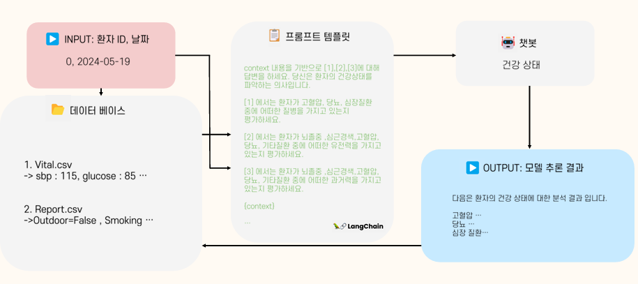
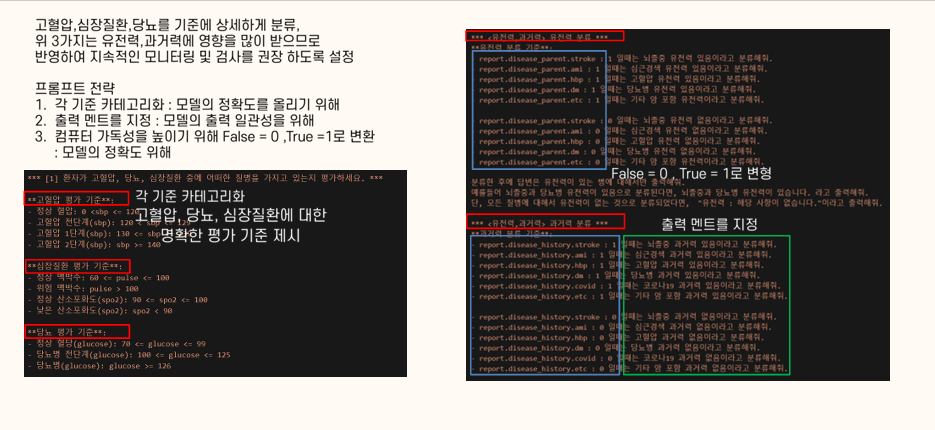
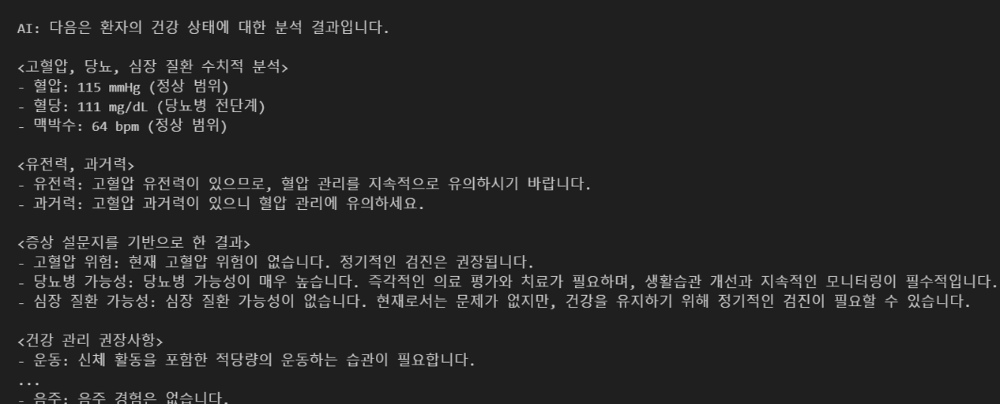
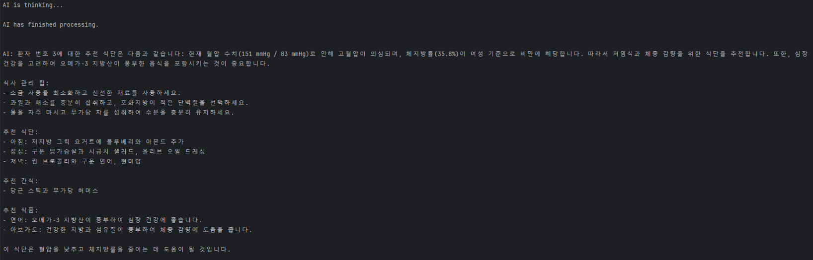
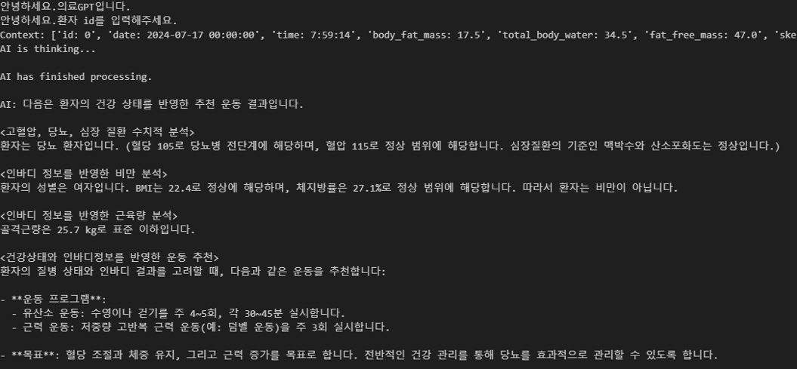

## Rag Chain을 활용한 건강 검진 정보기반 대화 GPT ## 

**프로젝트 기간: 2024.08.12 ~2024.08.19**
1. 아이디어 및 방법론 구축
2. 구현

**프로젝트 개요**  
고령 만성 질환자(고혈압,당뇨,심장질환) 대상의 챗봇 서비스 개발  
3가지 기능으로 구성
1. 건강 상태 분석 Chatbot : 고령의 환자의 건강 검진 기록표를 기반으로 한 환자 맞춤 건강 상태 분석하는 알고리즘 적용
2. 추천 식단 Chabot : 고령의 환자의 건강 검진 기록표를 기반으로 한 환자 맞춤 식단을 추천하는 알고리즘 적용
3. 추천 운동 Chabot : 고령의 환자에게 맞춤형 운동을 추처하기 위해,나이와 건강 상태를 고려한 알고리즘 적용

**구현**  
1. 데이터 전처리(vital,report,inbody csv 파일에서 각각 필요한 정보만을 추출)         
2. prompt를 통한 개개인이 정보를 반영한 맞춤형 chatbot 구성(Prompt templete을 개인 맞춤형 최상의 답변을 도출하기 위해 실험을 하여 구성)         

**결과**  
사용자가 환자 id와 날짜를 입력하고 1(건강상태),2(식단),3(운동) 원하는 기능을 입력하면 아래의 결과 도출

1. 건강 상태

2. 식단

3. 운동

**추가적인 구현**            
대화가 이어지도록 구현  
